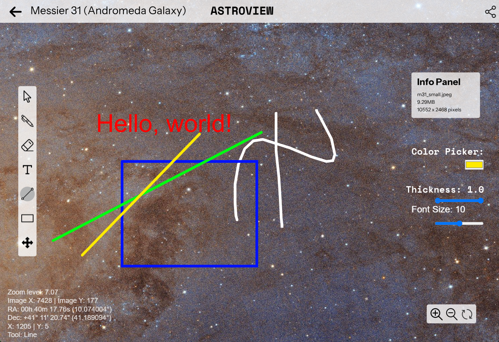
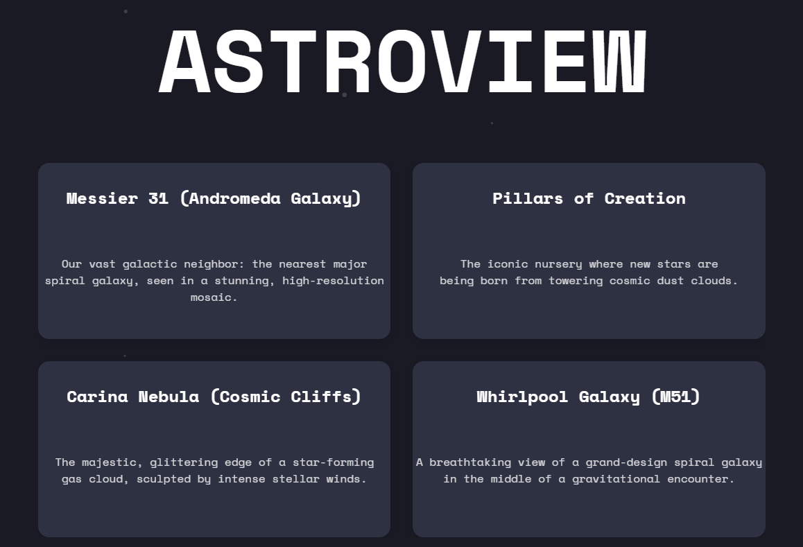

# 🌌 Astroview

This project is a submission for the [**NASA 2025 Space Apps Challenge**](https://www.spaceappschallenge.org/2025/).

✨ **ASTROVIEW** is a hub for **anyone** to explore and view splendid images of Space, Earth and Planets captured by satellites from [NASA](https://nasa.gov) and other Space Agencies. It can view images in **full resolution**, **zoom and pan** to **discover new patterns** and features, **annotate with pens and shapes of various thicknesses and colors** and just a click. A simple and intuitive experience to experience the marvelous universe we live in, simply from our browser. 🌐

🖼️Our project takes **high resolution images** from datasets by **NASA** or other Space Agencies, which is converted to a DeepZoom([.dzi](https://en.wikipedia.org/wiki/Deep_Zoom)) file format which contains thousands of smaller images, so that it can be viewed smoothly in lower-end devices and even embedded in browsers. Then, we annotate on top of the image using [**p5.js**](https://p5js.org/), a library of JavaScript used for simulation and creative coding. We host all these features on a web app made with **JavaScript, CSS and HTML**. We also used tools like [**Figma**](https://en.wikipedia.org/wiki/Figma) and [**Freeform**](https://apps.apple.com/us/app/freeform/id6443742539) to design and plan the features for our project.

